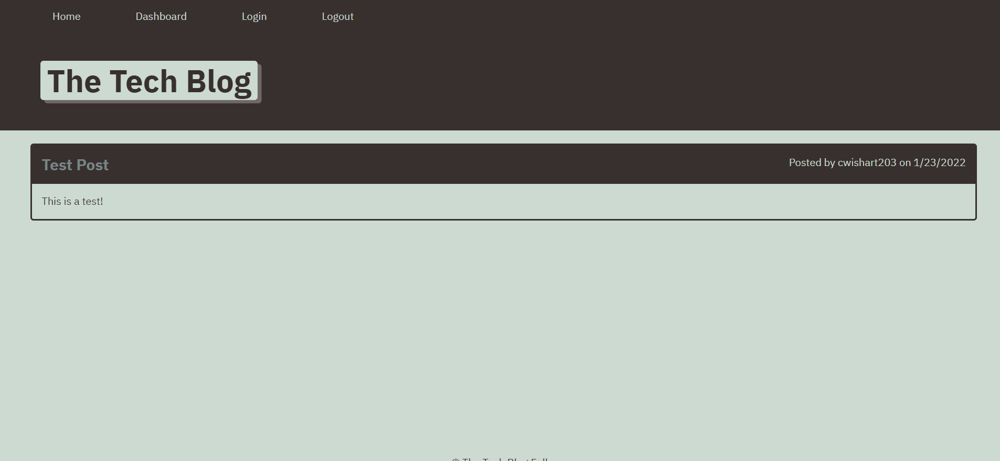

# Tech Blog

  

  ## Table of Contents
  - [Description](#Description)
  - [Installation](#Installation)
  - [Usage](#Usage)
  - [Tests](#Tests)
  - [License](#License)
  - [Questions](#Questions)
  - [Contributors](#Contributors)

  ## Screenshot
  

  ## Description
  This Tech Blog site is a CMS-style blog where the user can create blog posts as well as comment on posts made by other users.

  ## Installation
  Open the terminal and type "mysql -u root -p," input your MySQL password, then type "source db/schema.sql". Then open a new terminal, and run npm i.

  You may need to create a .env file, with the following code:

    DB_NAME=tech_blog_db

    DB_USER=root

    DB_PW=*Input your MySQL Password*

  ## Usage
  Open in terminal, make sure you have an instance of MySQL open and logged in, then type "npm start". Then open http://localhost:3001/ in your browser.

  ## Deployment
  https://cwish-tech-blog.herokuapp.com/

  ## Tests
  N/A

  ## License
  
   
  This application uses no license.

  ## Questions
  You can contact me for questions at my [email](mailto:cwishart203@gmail.com), or you can go to my [GitHub](https://github.com/cwishart203).

  ## Contributors
  N/A
